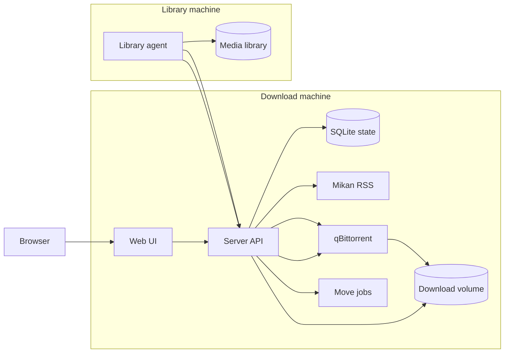

# Auto Bangumi

Auto Bangumi manages Mikan subscriptions, sends new episodes to qBittorrent, and moves completed files into a media library. It includes a web UI, a download-side server, and a library-side mover agent.

Chinese documentation: [README.zh-CN.md](README.zh-CN.md).

## Highlights

- Manage Mikan subscriptions from the web UI instead of editing config files.
- Store subscriptions and download state in SQLite, so runtime state has one source of truth.
- Keep qBittorrent private by default; only the app server is published to the host.
- Run everything on one machine for simple setups, or split the download server and library mover across two machines.
- Move completed files through the agent API path, so the qBittorrent host does not need direct access to the final media library.

## Quick Start

Prerequisite: Docker Desktop or Docker Engine with Compose.

```bash
cp .env.example .env
docker compose up -d
```

Open:

```text
http://localhost:3000
```

By default, completed files are written to `./library`. Change `HOST_LIBRARY_ROOT` in `.env` if your media library lives elsewhere.

## Runtime Model

The default `compose.yaml` pulls published GHCR images and runs everything on one machine:

- `server`: web UI, HTTP API, RSS polling, qBittorrent coordination, and move-job queue.
- `agent`: mover that writes completed files to the host media folder mounted at `/library`.
- `qbittorrent`: custom qBittorrent image with default WebUI credentials, tracker setup, and an internal download file server.

qBittorrent ports are not exposed by default. The server talks to qBittorrent over the private Docker network. After the agent reports a successful move, the server attempts to remove the qBittorrent task and downloaded source file.

If downloads and the final media library live on different machines, use the split deployment under `deploy/`. It runs the download server from `deploy/server/` and the library mover from `deploy/agent/`. See [deploy/README.md](deploy/README.md).



## Configuration

Runtime state lives in SQLite at `db/state.sqlite`. It is the source of truth for subscriptions, active downloads, move jobs, and completed history.

Common defaults:

- Web UI: `http://localhost:3000`
- qBittorrent API inside Docker: `qbittorrent:8080`
- qBittorrent file server inside Docker: `qbittorrent:8081`
- qBittorrent download path inside Docker: `/downloads`
- qBittorrent WebUI credentials: `admin / adminadmin`
- Active download limit: `20`
- Seeding cleanup: ratio `3.0` or `60` minutes
- Tracker list: `https://cf.trackerslist.com/all.txt`

Server login uses Basic Auth.

## Local Development

Install dependencies:

```bash
npm install
npm --prefix agent install
cp .env.example .env
cp agent/.env.example agent/.env
```

Start the development server:

```bash
npm run dev
```

Useful checks before committing:

```bash
npm run check
docker compose config
docker compose build qbittorrent server agent
```

## License

MIT. See [LICENSE](LICENSE).
