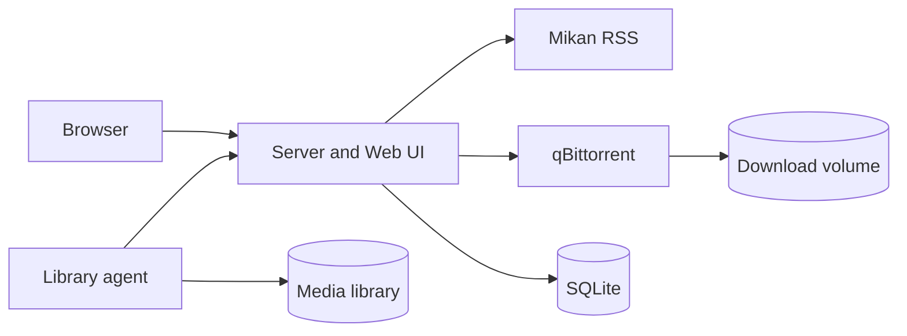

# Auto Bangumi

Auto Bangumi manages Mikan subscriptions, adds new episodes to qBittorrent, and moves completed files into a media library through a small mover agent.

Chinese documentation: [README.zh-CN.md](README.zh-CN.md).

## Features

- Search and manage Mikan subscriptions from the web UI.
- Store subscriptions, active downloads, move jobs, and history in SQLite.
- Keep qBittorrent private by default; only the app server is exposed.
- Run on one machine, or split the download server and library agent across machines.
- Remove qBittorrent tasks only after files are moved and qBittorrent reaches the seeding limit.

## Quick Start

```bash
cp .env.example .env
docker compose up -d
```

Open `http://localhost:3000`.

Completed files are written to `./library` by default. Change `HOST_LIBRARY_ROOT` in `.env` to use another media folder.

## Runtime Model

The root `compose.yaml` runs the normal single-machine setup:

- `server`: web UI, API, RSS polling, qBittorrent coordination, and move-job state.
- `agent`: writes completed files to the host media folder mounted at `/library`.
- `qbittorrent`: qBittorrent with default app config and an internal file server.

qBittorrent ports are not published. The server talks to qBittorrent on the Docker network. After the agent reports a successful move, qBittorrent keeps seeding until the ratio or time limit is reached, then the server deletes the qBittorrent task and source file.

Use [deploy/](deploy/README.md) when qBittorrent runs on a download box but the final media library lives on another machine, such as a NAS.



## Defaults

- Web UI: `http://localhost:3000`
- qBittorrent API in Docker: `qbittorrent:8080`
- qBittorrent file server in Docker: `qbittorrent:8081`
- qBittorrent WebUI: `admin / adminadmin`
- Active download limit: `20`
- Seeding limit: ratio `3.0` or `60` minutes
- Tracker list: `https://cf.trackerslist.com/all.txt`

## Development

```bash
npm install
npm --prefix agent install
cp .env.example .env
cp agent/.env.example agent/.env
npm run dev
```

Checks:

```bash
npm run check
docker compose config
docker compose build qbittorrent server agent
```

## License

MIT. See [LICENSE](LICENSE).
