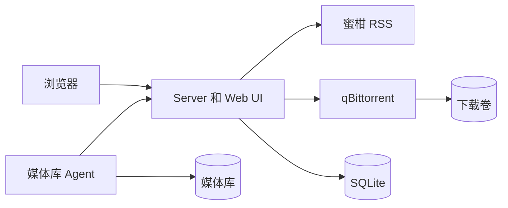

# Auto Bangumi

Auto Bangumi 用来维护蜜柑订阅、把新剧集添加到 qBittorrent，并通过 Agent 把下载完成的文件整理到媒体库。

## 功能

- 在 Web UI 里搜索和维护蜜柑订阅。
- 用 SQLite 保存订阅、下载、迁移任务和历史记录。
- 默认不暴露 qBittorrent，只开放应用服务。
- 支持单机部署，也支持下载机和媒体库机器分开部署。
- 文件入库成功后继续做种，达到分享率或时间限制后再删除 qBittorrent 任务和源文件。

## 快速开始

```bash
cp .env.example .env
docker compose up -d
```

打开 `http://localhost:3000`。

默认媒体库目录是 `./library`。如果要写到其他位置，修改 `.env` 里的 `HOST_LIBRARY_ROOT`。

## 运行模型

根目录 `compose.yaml` 是默认单机部署：

- `server`：Web UI、API、RSS 轮询、qBittorrent 调度和迁移状态。
- `agent`：把完成下载的文件写入挂载到 `/library` 的宿主机媒体库目录。
- `qbittorrent`：带默认应用配置和内部文件服务的 qBittorrent。

qBittorrent 端口默认不发布到宿主机。Agent 回报入库成功后，qBittorrent 继续做种；等分享率或做种时间达到限制并停止后，server 再删除 qBittorrent 任务和源文件。

如果 qBittorrent 在下载机上，最终媒体库在 NAS 或另一台机器上，用 [deploy/](deploy/README.zh-CN.md) 的分机器部署。



## 默认值

- Web UI：`http://localhost:3000`
- 应用登录：使用 `.env` 里的 `SERVER_USERNAME` 和 `SERVER_PASSWORD`
- Docker 内 qBittorrent API：`qbittorrent:8080`
- Docker 内 qBittorrent 文件服务：`qbittorrent:8081`
- qBittorrent WebUI：`admin / adminadmin`
- 最大活跃下载数：`20`
- 做种限制：分享率 `3.0` 或 `60` 分钟
- Tracker 列表：`https://cf.trackerslist.com/all.txt`

## 本地开发

请先安装 [mise](https://mise.jdx.dev/)，然后安装项目指定的 Node.js 26 运行时：

```bash
mise install
```

```bash
npm install
npm --prefix agent install
cp .env.example .env
cp agent/.env.example agent/.env
npm run dev
```

检查：

```bash
npm run check
docker compose config
docker compose build qbittorrent server agent
```

## License

MIT，见 [LICENSE](LICENSE)。
