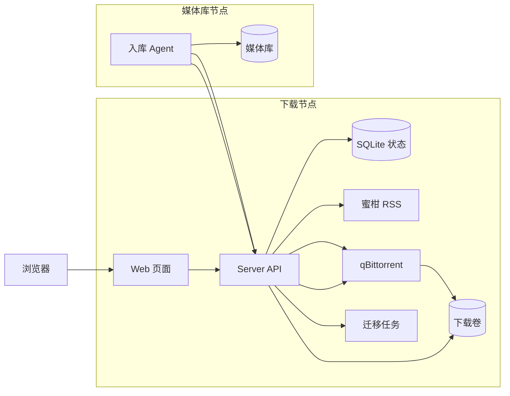

# Auto Bangumi

Auto Bangumi 用来订阅蜜柑番剧、自动把新剧集添加到 qBittorrent，并在下载完成后整理到媒体库。项目内置 Web 管理页面，也支持把“下载”和“入库”拆到不同机器上运行。

## 项目特点

- 在网页里搜索和维护蜜柑订阅，不需要手动改配置文件。
- 订阅、下载进度、迁移任务和历史记录统一写入 SQLite。
- qBittorrent 默认只在 Docker 内部网络可见，不直接暴露到宿主机。
- 单机部署可以直接开箱使用；有需要时，也可以把下载节点和媒体库节点分开部署。
- 文件入库由 Agent 从下载节点拉取完成，qBittorrent 所在机器不需要挂载最终媒体库目录。

## 快速开始

先安装 Docker Desktop 或 Docker Engine with Compose。

```bash
cp .env.example .env
docker compose up -d
```

打开：

```text
http://localhost:3000
```

默认媒体库目录是 `./library`。如果要写到其他位置，修改 `.env` 里的 `HOST_LIBRARY_ROOT`。

## 运行方式

根目录的 `compose.yaml` 是默认的单机部署方案，会直接拉取 GHCR 镜像，并启动三个服务：

- `server`：提供 Web 页面和 API，负责 RSS 轮询、qBittorrent 调度和迁移任务管理。
- `agent`：负责把下载完成的文件写入挂载到 `/library` 的宿主机媒体库目录。
- `qbittorrent`：内置默认配置、tracker 配置和内部文件服务的 qBittorrent。

默认情况下，qBittorrent 不会开放端口到宿主机。`server` 通过 Docker 内部网络访问 qBittorrent。Agent 回报入库成功后，`server` 会尝试通过 qBittorrent API 删除对应的任务和下载源文件。

如果下载目录和最终媒体库不在同一台机器上，可以使用 `deploy/` 下的分机器部署：下载节点使用 `deploy/server/`，媒体库节点使用 `deploy/agent/`。具体步骤见 [deploy/README.zh-CN.md](deploy/README.zh-CN.md)。



## 配置

运行数据保存在 `db/state.sqlite`，它是订阅、活跃下载、迁移任务和完成历史的唯一状态源。

常用默认值：

- Web UI：`http://localhost:3000`
- Docker 内 qBittorrent API：`qbittorrent:8080`
- Docker 内 qBittorrent 文件服务：`qbittorrent:8081`
- Docker 内 qBittorrent 下载目录：`/downloads`
- qBittorrent WebUI 账号：`admin / adminadmin`
- 最大活跃下载数：`20`
- 做种清理：分享率达到 `3.0` 或做种满 `60` 分钟
- Tracker 列表：`https://cf.trackerslist.com/all.txt`

浏览器只能读取公开的订阅和下载状态。qBittorrent 凭据和迁移 token 只保存在服务端。

## 本地开发

安装依赖：

```bash
npm install
npm --prefix agent install
cp .env.example .env
cp agent/.env.example agent/.env
```

启动开发服务：

```bash
npm run dev
```

提交前常用检查：

```bash
npm run check
docker compose config
docker compose build qbittorrent server agent
```

## License

MIT，见 [LICENSE](LICENSE)。
